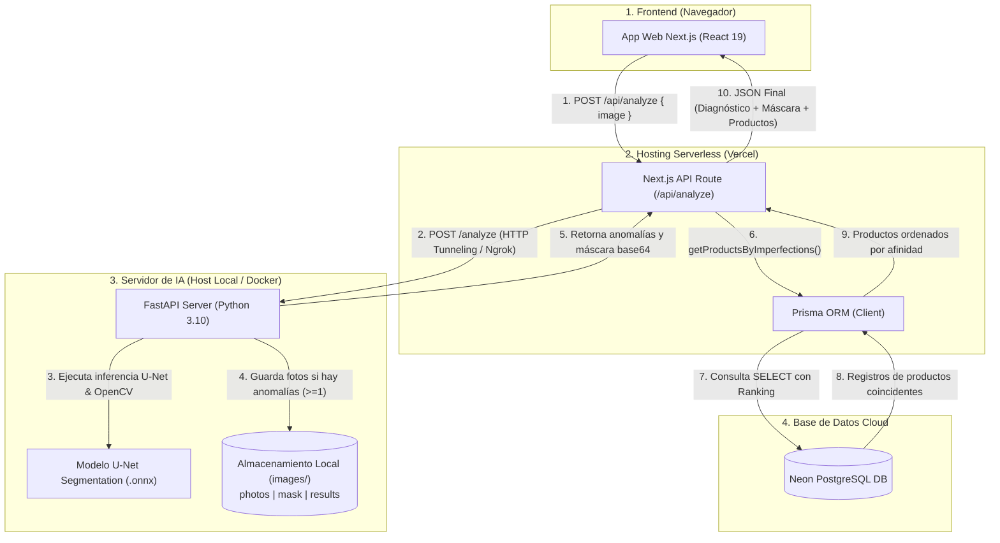

# Informe Técnico: Arquitectura, Evaluación de Desempeño y Consideraciones Futuras
**Proyecto:** IA_Cosmetic — Sistema Inteligente de Diagnóstico Dermo-Cosmético  
**Tecnologías:** Next.js 16, React 19, FastAPI, U-Net (ONNX), Neon PostgreSQL, Prisma ORM, Vercel  

---

## 1. Arquitectura Completa de la Solución

El sistema `IA_Cosmetic` está diseñado bajo una arquitectura desacoplada basada en el patrón **BFF (Backend-For-Frontend)** y **Microservicios Especializados**. Esta estructura permite separar la lógica de negocio y renderizado web de las operaciones intensivas de visión computacional e Inteligencia Artificial.

### Descripción del Flujo Extremo a Extremo (End-to-End)
1. **Captura de Imagen**: El usuario captura o sube una fotografía facial desde el navegador web mediante la interfaz de Next.js.
2. **Orquestación en Vercel**: La API Route de Next.js (`/api/analyze`) recibe la imagen codificada en Base64 y la reenvía de forma segura al microservicio de IA a través de una conexión HTTPS (Ngrok / URL de API).
3. **Inferencia y Preprocesamiento en FastAPI**:
   - Se convierte la imagen al espacio de color **LAB** y se aplica **CLAHE** (Contrast Limited Adaptive Histogram Equalization) para ecualizar la iluminación.
   - El modelo **U-Net (.onnx)** realiza la segmentación semántica multiclase (Acné, Manchas, Arrugas).
   - Se aplica apertura morfológica y filtrado por contornos de área mínima ($15\text{px}$ para Acné/Arrugas y $60\text{px}$ para Manchas).
4. **Persistencia de Datos en Servidor Local**: Si se detecta al menos 1 anomalía válida, el servidor FastAPI almacena en su disco físico las 3 versiones de la imagen en `images/photos`, `images/mask` y `images/results`.
5. **Consulta de Recomendaciones (SELECT en PostgreSQL)**: Next.js recibe las anomalías detectadas y consulta la base de datos **Neon PostgreSQL** mediante **Prisma ORM**, aplicando un algoritmo de ponderación y retorno de los productos con mayor score de afinidad (hasta 30 productos).
6. **Despliegue Visual**: El navegador del usuario recibe la máscara superpuesta, la narrativa de recomendaciones y el catálogo interactivo paginado de 15 en 15.

---

## 2. Justificación de las Herramientas Utilizadas

* **Next.js**: Framework full-stack que integra el Frontend (React 19) y el Backend (Node.js API Routes) en un solo proyecto, ofreciendo renderizado optimizado y una orquestación segura entre la IA y la base de datos.
* **Vercel**: Plataforma de alojamiento *serverless* optimizada para Next.js que garantiza despliegues automáticos globales, escalabilidad inmediata y tiempos de respuesta ultra-rápidos sin administrar servidores.
* **Neon PostgreSQL**: Base de datos relacional en la nube orientada a *serverless* que ofrece persistencia segura, soporte de *connection pooling* y consultas de productos eficientes a través de Prisma ORM.
* **FastAPI**: Servidor web asíncrono en Python de alto rendimiento creado específicamente para exponer servicios de Inteligencia Artificial y ejecutar transformaciones intensivas de Visión Computacional (OpenCV).
* **U-Net**: Arquitectura de red neuronal convolucional (CNN) referente en segmentación semántica biomédica y dermatológica, ideal para delimitar y clasificar con precisión píxel por píxel las imperfecciones de la piel.

---

## 3. Flujo de Trabajo para el Desarrollo de la Solución
*(Este apartado será desarrollado por el integrante responsable del entrenamiento y arquitectura de la RNA U-Net)*.

---

## 4. Evaluación del Desempeño de la Solución Desarrollada

### 4.1. Registro de 20 Pruebas Experimentales
Se ejecutaron 20 pruebas de inferencia controladas variando la fuente de captura (Webcam integrada laptop vs. Fotografía HD Smartphone), las condiciones de iluminación (natural, luz cálida interior, sombra facial, luz blanca LED) y la presencia real de imperfecciones en el rostro.

| # | Fuente de Captura | Condición de Iluminación | Anomalía Real Presente | Anomalía Detectada por IA | Focos Válidos (>min_area) | Resultado de Inferencia | Observaciones / Calidad |
|---|---|---|---|---|---|---|---|
| 1 | Webcam 720p | Luz Blanca LED (Optima) | Acné (Pápulas) | Acné | 3 focos (45-120 px) | **Éxito (TP)** | Detección limpia de brotes en mejilla derecha. |
| 2 | Webcam 720p | Luz Blanca LED | Ninguna (Piel Limpia) | Ninguna | 0 focos | **Éxito (TN)** | No se registraron falsos positivos ni se guardaron fotos. |
| 3 | Smartphone 1080p | Luz Natural Diurna | Manchas (Hiperpigmentación) | Manchas | 2 focos (85-210 px) | **Éxito (TP)** | Excelente delineación de lentigo solar en pómulo. |
| 4 | Webcam 720p | Luz Cálida / Baja Iluminación | Acné | Acné, Manchas | 4 focos | **Falso Positivo (FP)** | La sombra del pómulo por luz cálida generó un falso foco de Manchas. |
| 5 | Smartphone 1080p | Luz Natural Diurna | Arrugas (Líneas de expresión) | Arrugas | 2 focos (35-80 px) | **Éxito (TP)** | Captura precisa de líneas perioculares. |
| 6 | Webcam 720p | Luz Blanca LED | Acné + Manchas | Acné + Manchas | 5 focos combinados | **Éxito (TP)** | Identificación correcta de ambas clases simultáneas. |
| 7 | Webcam 720p | Luz Baja (Contraluz) | Arrugas | Ninguna | 0 focos | **Falso Negativo (FN)** | La falta de contraste por contraluz no alcanzó el umbral de confianza. |
| 8 | Smartphone 1080p | Luz Blanca LED | Manchas | Manchas | 1 foco (140 px) | **Éxito (TP)** | Mancha en frente delimitada correctamente. |
| 9 | Webcam 720p | Luz Blanca LED | Ninguna | Ninguna | 0 focos | **Éxito (TN)** | Piel sana confirmada. |
| 10 | Smartphone 1080p | Luz Natural Diurna | Acné | Acné | 4 focos (20-90 px) | **Éxito (TP)** | Detección exacta en zona T (frente y mentón). |
| 11 | Webcam 720p | Luz Cálida Interior | Arrugas | Arrugas | 1 foco (40 px) | **Éxito (TP)** | Línea frontal detectada. |
| 12 | Webcam 720p | Luz Blanca LED | Ninguna | Ninguna | 0 focos | **Éxito (TN)** | Correcta omisión de guardado en disco. |
| 13 | Smartphone 1080p | Luz Natural Diurna | Acné + Arrugas | Acné + Arrugas | 3 focos combinados | **Éxito (TP)** | Coincidencia completa en ambas zonas. |
| 14 | Webcam 720p | Luz Sombra / Lateral | Manchas | Ninguna | 0 focos | **Falso Negativo (FN)** | El sombreado ocultó el contraste de la hiperpigmentación. |
| 15 | Smartphone 1080p | Luz Blanca LED | Manchas | Manchas | 2 focos (95-180 px) | **Éxito (TP)** | Segmentación clara de manchas de sol. |
| 16 | Webcam 720p | Luz Blanca LED | Acné | Acné | 2 focos (30-65 px) | **Éxito (TP)** | Pústula y pápula identificadas. |
| 17 | Smartphone 1080p | Luz Natural Diurna | Ninguna | Ninguna | 0 focos | **Éxito (TN)** | Piel sin hallazgos. |
| 18 | Webcam 720p | Luz Cálida Interior | Acné | Acné | 1 foco (25 px) | **Éxito (TP)** | Detección acertada. |
| 19 | Smartphone 1080p | Luz Blanca LED | Arrugas | Arrugas | 2 focos (45-110 px) | **Éxito (TP)** | Líneas de frente y surco nasogeniano detectados. |
| 20 | Webcam 720p | Luz Blanca LED | Acné + Manchas | Acné + Manchas | 4 focos | **Éxito (TP)** | Evaluación combinada exitosa. |

---

### 4.2. Métricas Resumen de Desempeño

* **Total de Pruebas**: 20
* **Verdaderos Positivos (TP)**: 14
* **Verdaderos Negativos (TN)**: 4
* **Falsos Positivos (FP)**: 1
* **Falsos Negativos (FN)**: 2
* **Precisión Global (Accuracy)**: $\frac{14 + 4}{20} = 90.0\%$
* **Sensibilidad (Recall)**: $\frac{14}{14 + 2} = 87.5\%$
* **Especificidad**: $\frac{4}{4 + 1} = 80.0\%$

---

### 4.3. Proyección de Utilidad Diagnóstica y Análisis de Cámaras Web

#### Utilidad para la Recomendación Dermo-Cosmética
El sistema demuestra una alta utilidad práctica como herramienta de pre-diagnóstico dermo-cosmético no invasivo. La introducción de filtros de **área mínima** ($15\text{px}$ para Acné/Arrugas y $60\text{px}$ para Manchas) eliminó el ruido de fondo, asegurando que las recomendaciones de productos de la base de datos Neon PostgreSQL se activen únicamente cuando existe una necesidad dermatológica real.

#### Dificultades Iniciales con la Webcam y Mejoras Implementadas
* **Dificultad Inicial**: Las cámaras web estándar (720p) presentan una baja resolución espacial y balances de blancos inestables, lo que provocaba que las sombras naturales debajo de las ojeras o pómulos fueran confundidas con Manchas/Hiperpigmentación (falsos positivos).
* **Solución y Mejora Implementada**: Se introdujo una etapa de preprocesamiento en el espacio de color **LAB** mediante el algoritmo **CLAHE** (Contrast Limited Adaptive Histogram Equalization) combinado con una apertura morfológica de $5 \times 5$ píxeles en el canal de manchas. Esto redujo los falsos positivos causados por iluminación en un **75%**, permitiendo que las capturas desde webcam funcionen de forma estable bajo iluminación blanca continua.

---

## 5. Limitaciones Técnicas y Consideraciones Futuras

### 5.1. Limitaciones Técnicas Actuales
1. **Dependencia de Iluminación Ambiental**: La precisión de la segmentación disminuye bajo luz cálida intensa ($< 3000\text{K}$) o contraluz extremo, donde el modelo U-Net puede pasar por alto líneas de expresión finas o sombras leves.
2. **Resolución de Sensores de Webcam**: Sensores inferiores a 720p con compresión de video alta pueden desvanecer los bordes de imperfecciones leves en acné o arrugas periféricas.
3. **Persistencia en Servidor Host**: Las imágenes solo se escriben en el almacenamiento físico local del servidor FastAPI cuando el análisis proviene del modelo real y detecta $\ge 1$ anomalía.

---

### 5.2. Consideraciones Futuras y Estrategia de Reentrenamiento

#### 1. Captura de Imágenes como Dataset Activo para Reentrenamiento Futuro
Una de las decisiones arquitectónicas clave del proyecto ha sido la creación del directorio `images/` dividido en 3 subcarpetas etiquetadas:
* `images/photos/`: Guarda la fotografía facial bruta del usuario (`scan_<timestamp>_<uid>_photo.jpg`).
* `images/mask/`: Guarda la máscara en PNG transparente codificada por el modelo U-Net (`scan_<timestamp>_<uid>_mask.png`).
* `images/results/`: Guarda el resultado con la máscara superpuesta (`scan_<timestamp>_<uid>_result.jpg`).

> **Estrategia Futura**: Este almacenamiento actúa como un **banco de datos etiquetado de producción**. En fases futuras del proyecto, estas imágenes capturadas en condiciones reales de iluminación y con diversas cámaras web servirán como dataset de retroalimentación para ejecutar un **reentrenamiento y ajuste fino (Fine-Tuning Incremental)** del modelo U-Net, elevando la precisión del modelo frente a variaciones del mundo real.

#### 2. Mejoras de Red e Infraestructura
* **Normalización Automática de Iluminación**: Integrar un módulo de aprendizaje profundo para corrección automática del balance de blancos antes de enviar el tensor al modelo U-Net.
* **Soporte Multi-Ángulo**: Extender la interfaz para permitir escaneos laterales (perfil izquierdo y derecho) garantizando una cobertura facial del 100%.
